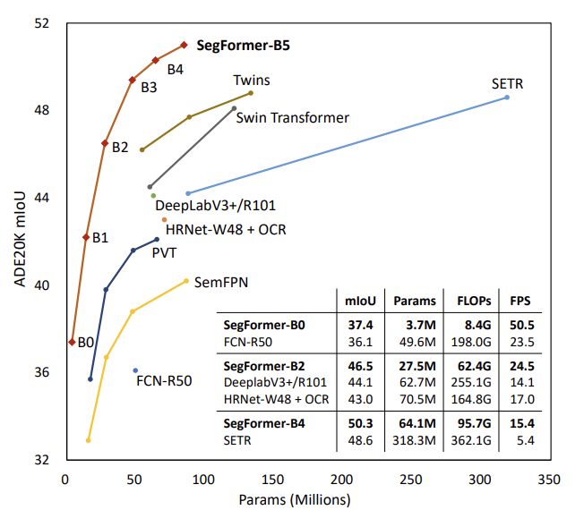
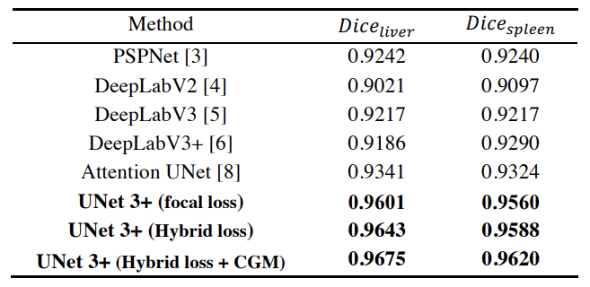

## Environments

- python: 3.9.12
- pytorch: 1.13.1+cu117

---

## Models

### Torchvision

- deeplabv3_resnet50
- deeplabv3_resnet101
- deeplabv3_mobilenet_v3_large

#### references

### DDRNet

- ddrnet_39
- ddrnet_23
- ddrnet_23_slim

#### references

- network & weights: https://github.com/ydhongHIT/DDRNet

### Deeplabv3+

#### references

- https://github.com/VainF/DeepLabV3Plus-Pytorch

### Segformer

#### references

- weights:
  - https://github.com/NVlabs/SegFormer
  - https://github.com/open-mmlab/mmsegmentation/tree/master/configs/segformer
- network: https://github.com/sithu31296/semantic-segmentation
- paper: https://arxiv.org/pdf/2105.15203.pdf

### Unet

- weights:
- network:
- paper:

---
